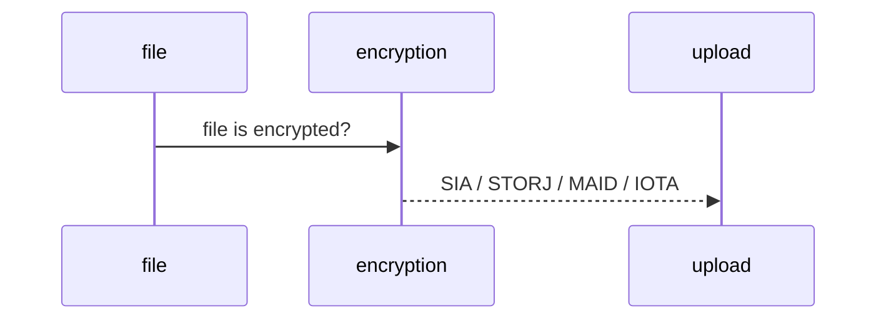

# Seather, Simple CMD Tool

> "... the multi-upload of decentralized storage" - Console

Upload and encrypt anyfile freely to decentralised storage networks.  

## Installation

For mac, liux or windows:
Install NODEJS
(use NVM on linux, Homebrew on mac or CHOCO on windows)

Then simply:

    npm install seather --global

To begin try:

    seather --help

 
Example:

    seather --upload test.png --encrypt pass1234
    seather --download qW5Ct9 --decrypt pass1234

 

  
  
  

(Currently only SIA is implimented)

(TO COME: Storj, Maidsafe, IOTA, Oyster, Filecoin)

  


## How?
Upload:
1) File is encrypted used one of many supported algorithms.
2) File is pushed to upload server
3) Upload server distributes file to decentralized networks
		ie: SIA / Storj / IOTA / Maidsafe / PERL.. etc..
4) ID to recover file is returned

Download:

1) File downloaded from from randomized distribution network using file ID
2) File is decrypted using one of supported algo's
3) File is ready to be used





## Supported Decentralised Networks (Future Support)
```
Iota, [CHECK]
SIA, [CHECK]
TRON, 
Storj, [CHECK]
FileCoin, 
enigma
maidsafe
Genaro Network
```

## Supported Algorithms

    AES-128-CBC
    
    AES-128-CFB
    
    AES-128-CFB1
    
    AES-128-CFB8
    
    AES-128-CTR
    
    AES-128-ECB
    
    AES-128-OFB
    
    AES-128-XTS
    
    AES-192-CBC
    
    AES-192-CFB
    
    AES-192-CFB1
    
    AES-192-CFB8
    
    AES-192-CTR
    
    AES-192-ECB
    
    AES-192-OFB
    
    AES-256-CBC
    
    AES-256-CFB
    
    AES-256-CFB1
    
    AES-256-CFB8
    
    AES-256-CTR
    
    AES-256-ECB
    
    AES-256-OFB
    
    AES-256-XTS
    
    AES128 => AES-128-CBC
    
    AES192 => AES-192-CBC
    
    AES256 => AES-256-CBC
    
    BF => BF-CBC
    
    BF-CBC
    
    BF-CFB
    
    BF-ECB
    
    BF-OFB
    
    CAMELLIA-128-CBC
    
    CAMELLIA-128-CFB
    
    CAMELLIA-128-CFB1
    
    CAMELLIA-128-CFB8
    
    CAMELLIA-128-ECB
    
    CAMELLIA-128-OFB
    
    CAMELLIA-192-CBC
    
    CAMELLIA-192-CFB
    
    CAMELLIA-192-CFB1
    
    CAMELLIA-192-CFB8
    
    CAMELLIA-192-ECB
    
    CAMELLIA-192-OFB
    
    CAMELLIA-256-CBC
    
    CAMELLIA-256-CFB
    
    CAMELLIA-256-CFB1
    
    CAMELLIA-256-CFB8
    
    CAMELLIA-256-ECB
    
    CAMELLIA-256-OFB
    
    CAMELLIA128 => CAMELLIA-128-CBC
    
    CAMELLIA192 => CAMELLIA-192-CBC
    
    CAMELLIA256 => CAMELLIA-256-CBC
    
    CAST => CAST5-CBC
    
    CAST-cbc => CAST5-CBC
    
    CAST5-CBC
    
    CAST5-CFB
    
    CAST5-ECB
    
    CAST5-OFB
    
    DES => DES-CBC
    
    DES-CBC
    
    DES-CFB
    
    DES-CFB1
    
    DES-CFB8
    
    DES-ECB
    
    DES-EDE
    
    DES-EDE-CBC
    
    DES-EDE-CFB
    
    DES-EDE-OFB
    
    DES-EDE3
    
    DES-EDE3-CBC
    
    DES-EDE3-CFB
    
    DES-EDE3-CFB1
    
    DES-EDE3-CFB8
    
    DES-EDE3-OFB
    
    DES-OFB
    
    DES3 => DES-EDE3-CBC
    
    DESX => DESX-CBC
    
    DESX-CBC
    
    IDEA => IDEA-CBC
    
    IDEA-CBC
    
    IDEA-CFB
    
    IDEA-ECB
    
    IDEA-OFB
    
    RC2 => RC2-CBC
    
    RC2-40-CBC
    
    RC2-64-CBC
    
    RC2-CBC
    
    RC2-CFB
    
    RC2-ECB
    
    RC2-OFB
    
    RC4
    
    RC4-40
    
    RC4-HMAC-MD5
    
    SEED => SEED-CBC
    
    SEED-CBC
    
    SEED-CFB
    
    SEED-ECB
    
    SEED-OFB
    
    AES-128-CBC
    
    AES-128-CFB
    
    AES-128-CFB1
    
    AES-128-CFB8
    
    AES-128-CTR
    
    AES-128-ECB
    
    id-aes128-GCM
    
    AES-128-OFB
    
    AES-128-XTS
    
    AES-192-CBC
    
    AES-192-CFB
    
    AES-192-CFB1
    
    AES-192-CFB8
    
    AES-192-CTR
    
    AES-192-ECB
    
    id-aes192-GCM
    
    AES-192-OFB
    
    AES-256-CBC
    
    AES-256-CFB
    
    AES-256-CFB1
    
    AES-256-CFB8
    
    AES-256-CTR
    
    AES-256-ECB
    
    id-aes256-GCM
    
    AES-256-OFB
    
    AES-256-XTS
    
    aes128 => AES-128-CBC
    
    aes192 => AES-192-CBC
    
    aes256 => AES-256-CBC
    
    bf => BF-CBC
    
    BF-CBC
    
    BF-CFB
    
    BF-ECB
    
    BF-OFB
    
    blowfish => BF-CBC
    
    CAMELLIA-128-CBC
    
    CAMELLIA-128-CFB
    
    CAMELLIA-128-CFB1
    
    CAMELLIA-128-CFB8
    
    CAMELLIA-128-ECB
    
    CAMELLIA-128-OFB
    
    CAMELLIA-192-CBC
    
    CAMELLIA-192-CFB
    
    CAMELLIA-192-CFB1
    
    CAMELLIA-192-CFB8
    
    CAMELLIA-192-ECB
    
    CAMELLIA-192-OFB
    
    CAMELLIA-256-CBC
    
    CAMELLIA-256-CFB
    
    CAMELLIA-256-CFB1
    
    CAMELLIA-256-CFB8
    
    CAMELLIA-256-ECB
    
    CAMELLIA-256-OFB
    
    camellia128 => CAMELLIA-128-CBC
    
    camellia192 => CAMELLIA-192-CBC
    
    camellia256 => CAMELLIA-256-CBC
    
    cast => CAST5-CBC
    
    cast-cbc => CAST5-CBC
    
    CAST5-CBC
    
    CAST5-CFB
    
    CAST5-ECB
    
    CAST5-OFB
    
    des => DES-CBC
    
    DES-CBC
    
    DES-CFB
    
    DES-CFB1
    
    DES-CFB8
    
    DES-ECB
    
    DES-EDE
    
    DES-EDE-CBC
    
    DES-EDE-CFB
    
    DES-EDE-OFB
    
    DES-EDE3
    
    DES-EDE3-CBC
    
    DES-EDE3-CFB
    
    DES-EDE3-CFB1
    
    DES-EDE3-CFB8
    
    DES-EDE3-OFB
    
    DES-OFB
    
    des3 => DES-EDE3-CBC
    
    desx => DESX-CBC
    
    DESX-CBC
    
    id-aes128-GCM
    
    id-aes192-GCM
    
    id-aes256-GCM
    
    idea => IDEA-CBC
    
    IDEA-CBC
    
    IDEA-CFB
    
    IDEA-ECB
    
    IDEA-OFB
    
    rc2 => RC2-CBC
    
    RC2-40-CBC
    
    RC2-64-CBC
    
    RC2-CBC
    
    RC2-CFB
    
    RC2-ECB
    
    RC2-OFB
    
    RC4
    
    RC4-40
    
    RC4-HMAC-MD5
    
    seed => SEED-CBC
    
    SEED-CBC
    
    SEED-CFB
    
    SEED-ECB
    
    SEED-OFB


